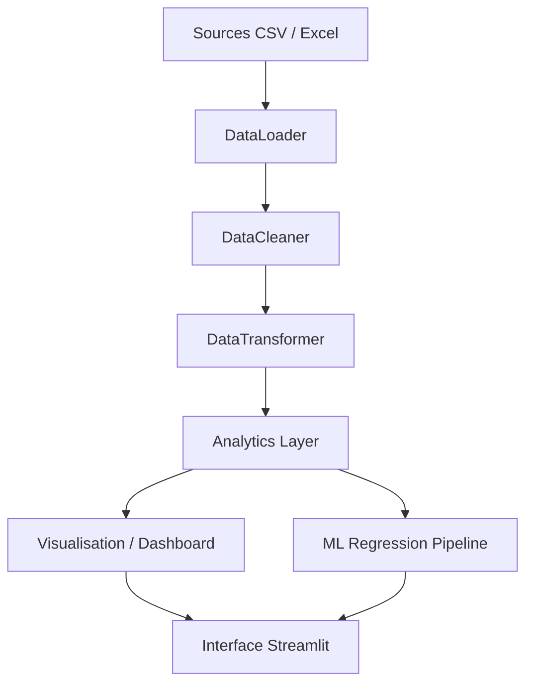
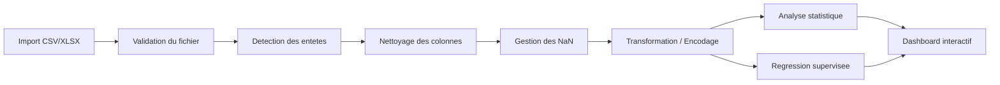

# Rapport Technique Complet

## Projet

**Nom du projet :** Advanced Analytics and Data Preprocessing Platform with Dashboard Integration  
**Langue :** Français  
**Type de document :** Rapport technique, scientifique et d'architecture logicielle  
**Version :** 1.0  

## Hypotheses de cadrage

Certaines informations du brief initial n'etaient pas renseignees explicitement, notamment l'objectif formel, les indicateurs metier et les resultats cibles. Le present rapport s'appuie donc sur les elements observables dans le depot du projet, en particulier l'application Streamlit, les modules Python de traitement de donnees, d'analyse statistique, de machine learning, les fichiers de configuration, les tests automatises et les workflows CI/CD. Les hypotheses suivantes ont ete retenues :

- L'objectif principal du projet est de fournir une plateforme integree permettant l'import de donnees tabulaires, leur nettoyage, leur transformation, leur analyse statistique, leur visualisation et la creation de modeles predictifs de regression.
- La cible fonctionnelle est un public d'analystes, d'ingenieurs data, de profils qualite/production et de decideurs souhaitant manipuler des jeux de donnees heterogenes sans reconstruire un pipeline analytique a chaque usage.
- Les technologies effectivement utilisees dans le projet sont notamment Python, Streamlit, Pandas, NumPy, SciPy, scikit-learn, Plotly, Matplotlib, Seaborn, category_encoders, OpenPyXL, Docker, pytest, Ruff, Black, mypy et GitHub Actions.
- Les resultats techniques objectivement verifies au moment de la redaction sont les suivants : la suite de tests du projet passe integralement, avec 54 tests reussis ; les principaux modules de chargement, transformation, nettoyage, statistiques et apprentissage sont fonctionnels ; les pipelines de regression s'executent correctement apres durcissement de la configuration de parallelisme.

---

## 1. Resume et synthese executive

Le projet **Advanced Analytics and Data Preprocessing Platform with Dashboard Integration** constitue une plateforme analytique unifiee orientee donnees tabulaires. Sa proposition de valeur repose sur une combinaison de cinq briques principales : l'acquisition de donnees, le pretraitement intelligent, la transformation structurante, l'analyse avancee, puis la visualisation et la prediction dans une interface unifiee. D'un point de vue produit, il s'agit d'un outil de reduction de friction entre l'arrivee des donnees et leur valorisation decisionnelle. D'un point de vue technique, il s'agit d'un prototype avance en voie d'industrialisation.

L'inspection du code montre que le projet dispose deja d'une base robuste : un socle `src/` modulaire, un ensemble de tests unitaires, des configurations de qualite logicielle, un container Docker et des workflows CI/CD. Les composants metier couvrent des cas d'usage essentiels en data engineering et data science : chargement de fichiers CSV/Excel, nettoyage des colonnes, conversion de types, imputation de valeurs manquantes, fusion et regroupement de jeux de donnees, encodage categoriel, tests statistiques, detection d'anomalies, et creation de modeles de regression avec selection de modele.

La principale faiblesse du systeme est de nature architecturale. L'application de presentation Streamlit concentre encore une large partie de l'orchestration applicative dans un fichier monolithique. Cela augmente le couplage, la difficulte de maintenance, le risque de regression et le cout de comprehension. En outre, plusieurs comportements initialement prototypiques ont ete detectes : journalisation heterogene, duplication de certaines logiques de transformation, configuration principalement basee sur des constantes, et pipeline de machine learning trop sensible aux contraintes d'execution locales lorsqu'il forcait le parallelisme maximal.

Une refactorisation partielle a ete menee dans le cadre de l'audit. Elle a permis de centraliser des utilitaires de normalisation de colonnes et de fusion date/heure, de renforcer le chargeur de donnees, de typer davantage la configuration, de rendre les transformations plus coherentes et d'ameliorer la robustesse du module de machine learning. En particulier, le parallelisme de la recherche d'hyperparametres a ete rendu configurable et securise, ce qui supprime un point d'echec critique. La plateforme atteint ainsi un niveau de maturite satisfaisant pour une phase pre-production technique.

Sur le plan strategique, le projet a un fort potentiel car il reunit dans une seule interface des fonctionnalites qui sont souvent dispersees entre notebooks, scripts ponctuels, outils BI et utilitaires ETL. Pour passer d'un prototype robuste a une solution de production, trois axes sont prioritaires : la decomposition applicative de l'interface, l'industrialisation du schema de configuration et des artefacts, et la formalisation d'un pipeline MLOps simple mais traçable pour les modeles entraines.

En synthese, la plateforme repond correctement au besoin fonctionnel de pretraitement et d'analytique integree. Elle se distingue par son large spectre fonctionnel et son bon niveau de testabilite. Son principal enjeu n'est plus la faisabilite, mais la structuration definitive de son architecture logicielle pour garantir scalabilite, maintenabilite, auditabilite et reutilisation.

---

## 2. Introduction et problematique

### 2.1 Contexte

La transformation numerique des organisations s'accompagne d'une croissance constante du volume de donnees semi-structurees et tabulaires. Dans les environnements industriels, logistiques, qualite, finance ou operations, ces donnees proviennent frequemment de fichiers CSV et Excel, de tableaux exportes depuis des applications tierces, ou de consolidations manuelles heterogenes. Avant meme l'etape de modelisation, une part importante de l'effort analytique est absorbee par des taches peu valorisees mais indispensables : detection d'en-tetes mal positionnes, correction des types, suppression de colonnes parasites, traitement des valeurs manquantes, alignement des jeux de donnees et normalisation des variables.

Dans de nombreuses equipes, ces operations sont encore menees de maniere artisanale, a l'aide de notebooks disperses, de scripts locaux difficilement reutilisables, ou de manipulations manuelles dans des tableurs. Cette situation produit plusieurs effets negatifs : faible reproductibilite, multiplication des erreurs humaines, lenteur des cycles d'analyse, difficulte d'industrialisation et faible capitalisation des bonnes pratiques.

Le projet ici etudie s'inscrit precisement dans cette zone de friction. Il vise a proposer une plateforme unifiee capable de reduire la distance entre donnees brutes et exploitation analytique. L'originalite du projet ne reside pas dans l'invention d'un nouvel algorithme fondamental, mais dans l'orchestration cohérente de briques techniques existantes au sein d'un environnement applicatif accessible.

### 2.2 Problem statement

La problematique centrale peut etre formulee ainsi :

**Comment concevoir une plateforme integrant acquisition, pretraitement, analyse statistique, visualisation et apprentissage automatique sur des donnees tabulaires heterogenes, tout en garantissant robustesse logicielle, reutilisabilite, traçabilite et aptitude a la mise en production ?**

Cette question se declenche a l'intersection de plusieurs enjeux :

- Un enjeu de qualite de donnees : la valeur des analyses depend directement de la fiabilite des donnees nettoyees.
- Un enjeu de productivite analytique : l'utilisateur doit pouvoir passer rapidement de l'import a l'insight.
- Un enjeu de gouvernance logicielle : un projet de ce type doit eviter de rester un simple assemblage de scripts.
- Un enjeu de generabilite : la plateforme doit etre applicable a des donnees diverses, et non a un unique cas d'usage figé.
- Un enjeu d'evolutivite : le systeme doit pouvoir integrer de nouveaux algorithmes, de nouvelles visualisations et des usages MLOps plus matures.

### 2.3 Objectifs du projet

Au vu du code disponible, les objectifs principaux peuvent etre reformules de la maniere suivante :

1. Fournir une interface web interactive permettant l'import et l'exploration de fichiers tabulaires.
2. Integrer un pipeline de nettoyage et de transformation pour rendre les donnees exploitables.
3. Offrir des outils d'analyse descriptive, statistique inferentielle et detection d'anomalies.
4. Permettre la construction automatisee de modeles de regression avec comparaison de plusieurs familles d'algorithmes.
5. Restituer les resultats via tableaux de bord et graphiques interactifs.
6. Constituer un socle logiciel suffisamment propre pour supporter l'industrialisation.

### 2.4 Portee et limites

La portee actuelle du projet couvre principalement les donnees tabulaires de taille raisonnable, chargees en memoire via Pandas. Le systeme vise davantage la flexibilite analytique que le calcul distribue. Il convient donc bien a des usages exploratoires, metiers et analytiques locaux, mais n'a pas encore vocation a remplacer une architecture Big Data ou un environnement MLOps distribue complet.

---

## 3. Etat de l'art et fondements conceptuels

### 3.1 Plateformes analytiques et pretraitement des donnees

Les plateformes analytiques modernes se structurent souvent autour de quatre couches : ingestion, preparation, analyse et restitution. Des outils comme KNIME, Alteryx, Dataiku, Power BI ou certains environnements cloud integres proposent des workflows visuels couvrant une partie de ce spectre. Toutefois, ces solutions presentent plusieurs limites dans certains contextes : cout de licence, faible customisation algorithmique, dependance a un ecosystème proprietaire, ou inadéquation avec des pipelines Python existants.

Le positionnement de la presente plateforme est interessant car elle combine l'ergonomie d'une interface applicative avec la souplesse de l'ecosystème scientifique Python. Cette strategie est frequemment adoptee pour construire des outils analytiques metier : l'interface devient un point d'acces unifie tandis que la logique metier reste codable, testable et versionnable.

### 3.2 Traitement de la qualite des donnees

La litterature sur la qualite des donnees distingue classiquement plusieurs dimensions : completude, coherence, exactitude, unicite, actualite, et conformite. Dans les jeux de donnees tabulaires, les operations de preparation typiques portent sur :

- la gestion des valeurs manquantes,
- la detection des doublons,
- la correction des types de donnees,
- la normalisation syntaxique des colonnes,
- l'harmonisation temporelle,
- la reduction du bruit et des attributs peu informatifs.

Le projet implemente une part importante de ces principes. Il s'agit d'une demarche pragmatique de data quality engineering. L'orientation choisie est plus operationnelle que theorique : elle cherche d'abord a produire un dataframe exploitable, lisible et numeriquement compatible avec les algorithmes aval.

### 3.3 Encodage de variables categorielles

L'encodage des variables categorielles est un probleme classique du machine learning supervise. L'encodage one-hot est simple, interpretable et robuste pour les faibles cardinalites, mais peut exploser la dimensionnalite. L'encodage cible, quant a lui, projette les categories dans un espace numerique base sur l'information du target. Il est souvent plus compact, mais plus sensible au leakage s'il n'est pas encadre correctement.

Le projet adopte une logique heuristique intelligente :

- suppression des colonnes quasi-uniques,
- one-hot encoding pour les faibles cardinalites,
- target encoding pour les cardinalites elevees lorsque la cible est disponible.

Ce choix est pertinent dans un environnement orienté productivite. Il traduit une recherche d'automatisation raisonnable, a condition de renforcer a terme les garde-fous contre les fuites d'information lors de la validation.

### 3.4 Regression supervisee et selection de modele

La regression supervisee vise a estimer une fonction `f(X)` telle que `y ≈ f(X)`, ou `X` est l'ensemble des variables explicatives et `y` une variable continue. Le projet compare plusieurs modeles :

- regression lineaire,
- regression Ridge,
- regression Lasso,
- Random Forest Regressor,
- Gradient Boosting Regressor.

Cette selection couvre un spectre utile :

- modeles lineaires interpretablés,
- regularisation pour limiter le sur-apprentissage,
- modeles d'ensemble non lineaires capables de capturer des interactions complexes.

L'approche par `GridSearchCV` est une methode de reference pour la recherche d'hyperparametres dans des espaces discrets de taille raisonnable. Elle est bien adaptee a un contexte applicatif de preuve de valeur.

### 3.5 Interfaces analytiques interactives

Streamlit s'est impose comme un standard de facto pour le prototypage rapide d'applications data interactives. Sa force repose sur un couplage direct entre logique Python et interface declarative. Cette approche accelere fortement le time-to-demo, mais tend aussi a favoriser les scripts monolithiques lorsque la croissance du produit n'est pas encadree par une architecture modulaire. Le present projet illustre precisement cette tension : Streamlit a permis une mise a disposition rapide, mais la prochaine etape impose une decomposition applicative plus nette.

---

## 4. Acquisition des donnees et pretraitement

### 4.1 Nature des donnees prises en charge

La plateforme est conçue pour manipuler des donnees tabulaires stockees dans des fichiers CSV et Excel. Ce choix est strategique. Dans beaucoup d'environnements metiers, ces formats sont la forme la plus courante de circulation de la donnee, meme lorsqu'ils proviennent en amont de bases de donnees, d'ERP, de MES, de capteurs ou de consolidations humaines.

Le module de chargement detecte les formats supportes, supprime les colonnes anonymes de type `Unnamed`, gere certaines particularites d'index et peut rechercher des lignes susceptibles d'etre des lignes d'en-tete reel. Cette derniere fonctionnalite est particulierement utile dans les exports metiers mal structures, ou la premiere ligne du fichier ne correspond pas toujours au schema logique du tableau.

### 4.2 Logique de chargement

Le chargeur s'appuie sur une sequence simple :

1. validation de l'existence du fichier et de son extension,
2. chargement conditionnel selon le type de fichier,
3. recherche de lignes contenant des mots-cles de type date/heure/annee/mois,
4. relecture eventuelle avec entete corrige,
5. suppression des colonnes parasites,
6. tentative de conversion des colonnes objet majoritairement numeriques.

Cette logique melange heuristiques semantiques et securisation syntaxique. Elle est bien adaptee a un produit orienté usager, ou l'on cherche a absorber une certaine variete de donnees imparfaites sans imposer a l'utilisateur une normalisation prealable trop forte.

### 4.3 Nettoyage des colonnes

L'etape de standardisation des colonnes remplit un role central. Une colonne telle que `Age (%)`, ` Age ` ou `Poste/Equipe` doit devenir un identifiant stable, exploitable par les pipelines et facile a manipuler. La normalisation appliquee convertit les noms en minuscules, supprime certains caracteres speciaux et remplace les separateurs par des underscores.

Mathematiquement, cette etape ne modifie pas l'information de contenu, mais elle reduit la variance syntaxique du schema. On peut l'interpreter comme une projection d'un espace de noms non contraint vers un espace canonique fini. Cette reduction de variance est essentielle pour :

- la reproductibilite des traitements,
- la robustesse des references de colonnes,
- la reduction des erreurs d'execution dues a des fautes de frappe ou a des divergences d'encodage.

### 4.4 Conversion de types et optimisation memoire

Le projet intègre des heuristiques de conversion numerique et d'optimisation des types. Les colonnes objet sont examinees afin d'identifier celles dont la majorite des valeurs peut etre interpretee comme numerique. Ensuite, les types numeriques peuvent etre compactes (`int64` vers `int32`, `int16`, voire `int8`, `float64` vers `float32`) lorsque les bornes le permettent.

Du point de vue algorithmique, cette optimisation a deux effets :

- diminution de l'empreinte memoire,
- acceleration potentielle des traitements vectorises.

Si `n` est le nombre de lignes et `p` le nombre de colonnes, la memoire occupee par une matrice dense numerique est de l'ordre de `O(n*p*s)` ou `s` est la taille du type en octets. Reduire `s` de 8 a 4 octets peut donc diviser par deux la place memoire de certaines parties du dataset. Dans une application interactive, cet effet est loin d'etre negligeable.

### 4.5 Traitement des valeurs manquantes

La plateforme implemente deux grandes strategies de traitement des valeurs manquantes :

- un mode statique,
- un mode base sur une logique de frequence ou de groupement par blocs de lignes.

Le mode statique remplit les valeurs numeriques par la moyenne et les variables categorielles par le mode ou par une valeur sentinelle. Cette strategie est classique, rapide et simple a expliquer. Elle peut toutefois lisser certaines distributions et reduire artificiellement la variance.

Le mode frequence est plus original. Il tente de grouper les lignes par paquets et, au sein de chaque groupe, d'imputer les valeurs manquantes via la mediane des valeurs disponibles, sinon par zero. Cette logique parait avoir ete pensee pour des donnees pseudo-temporelles ou des mesures repetitives organisees par cadence. Son interet est de mieux respecter une structure locale que ne le ferait une moyenne globale. En revanche, sa pertinence depend fortement de la sémantique reelle des lignes.

### 4.6 Fusion des colonnes date et heure

La plateforme detecte la presence potentielle de colonnes de type date et heure separees, puis les fusionne dans une variable `date_time`. Cette etape est analytique cruciale. Dans beaucoup de contextes industriels ou de supervision, la composante temporelle est le pivot de l'analyse. Or des colonnes separees ou mal formatees empechent souvent les regroupements temporels, les analyses de saisonnalite, les interpolations ou les graphes chronologiques.

La fusion repose sur des heuristiques linguistiques (`date`, `timestamp`, `jour`, `heure`, `time`, etc.) et sur une normalisation de differents formats horaires. Le principe est de construire une representation horodatée standard qui pourra ensuite servir d'axe commun a la visualisation, au groupement ou a l'inference.

### 4.7 Feature engineering

Le projet realise un feature engineering principalement structurel plutot que fortement metier. Les transformations notables sont :

- encodage categoriel,
- creation eventuelle d'une variable `date_time`,
- regroupements et agregations sur des colonnes de groupement,
- nettoyage des colonnes peu exploitables,
- suppression de colonnes quasi-identifiantes.

Cette approche est coherente pour une plateforme generique. Elle ne presuppose pas un domaine unique, mais elle gagnerait a etre completee par une couche optionnelle de transformations specialisees par secteur, par exemple pour des donnees industrielles, energetiques, RH ou commerciales.

---

## 5. Architecture systeme et methodologie

### 5.1 Vue d'ensemble

L'architecture du projet peut etre comprise comme une architecture en couches semi-modulaire :



Cette representation est utile car elle montre que le coeur metier ne se limite pas a l'interface. Le projet possede deja des composants reutilisables independamment de Streamlit. C'est un point fort important pour une future industrialisation.

### 5.2 Modules observables dans le depot

Le depot contient les zones fonctionnelles suivantes :

- `src/data_processing/` pour le chargement, nettoyage et la transformation,
- `src/analytics/` pour l'analyse statistique, la qualite et les modeles ML,
- `src/visualization/` pour les graphiques, tableaux de bord et rapports,
- `config/` pour les reglages et la journalisation,
- `tests/` pour les tests unitaires,
- `.github/workflows/` pour l'integration continue et le deploiement,
- `Dockerfile` pour l'encapsulation runtime.

Cette structuration indique une volonte claire de sortir du notebook et d'aller vers une veritable application logicielle. Cependant, l'orchestration reste encore fortement concentree dans le fichier principal Streamlit.

### 5.3 Problematique architecturale centrale

Le principal point de dette technique n'est pas l'absence de modules, mais l'ecart entre l'existence de ces modules et leur gouvernance effective depuis l'application. Le fichier principal reste un point de coordination hypertrophie, responsable a la fois :

- de l'initialisation de l'etat,
- des interactions utilisateur,
- du routage de pages,
- du declenchement des traitements,
- du stockage de resultats intermediaires,
- de l'affichage des sorties.

Une telle concentration produit plusieurs consequences :

- couplage fort entre UI et logique metier,
- difficulte de test de bout en bout,
- faible lisibilite du flux applicatif,
- cout d'evolution croissant.

### 5.4 Journalisation et observabilite

Le projet possede un module de configuration du logging, avec rotation des fichiers. C'est une bonne pratique. Toutefois, l'etat initial montrait encore un usage mixte de `print` et de `logging`. Or la journalisation n'est pas un simple confort, mais un mecanisme fondamental d'observabilite. Une architecture analytique serieuse doit pouvoir repondre a des questions telles que :

- quelle operation a ete executee,
- sur quel fichier,
- avec quels parametres,
- combien de lignes ont ete affectees,
- quelles erreurs ont ete rencontrees,
- quel modele a ete selectionne,
- avec quelles performances.

La progression vers une journalisation structuree est donc un prealable important a la mise en production.

### 5.5 Configuration et reproductibilite

Le projet definissait initialement une grande partie de ses reglages sous forme de constantes de module. Cette approche est acceptable au stade prototype, mais devient limitante lorsque les environnements se multiplient. Une solution plus mature consiste a distinguer :

- les constantes metier stables,
- les parametres d'execution par environnement,
- les parametres experimentaux de modelisation,
- les chemins et artefacts.

L'ajout d'une structure typee `AppSettings` constitue un premier pas dans cette direction. A terme, une couche `pydantic-settings` ou des fichiers YAML versionnes par environnement rendraient la configuration plus flexible, validable et injectable.

### 5.6 MLOps et infrastructure

Le projet n'est pas encore une plateforme MLOps complete, mais il en possede certains germes :

- emballage Docker,
- tests automatises,
- controle de qualite du code,
- export d'artefacts de modele,
- workflows GitHub Actions.

L'etape suivante consisterait a formaliser :

- la version des jeux de donnees,
- le suivi des experiences,
- la traçabilite des hyperparametres,
- la gestion des artefacts de modele,
- la validation de schema en entree,
- le monitoring du drift en production.

---

## 6. Implementation algorithmique et fondements mathematiques

### 6.1 Formulation du pipeline

Le pipeline supervisé du projet peut se resumer comme suit :

1. Chargement et nettoyage du dataset `D`.
2. Separation en variables explicatives `X` et variable cible `y`.
3. Elimination des lignes pour lesquelles `y` est manquant.
4. Conversion, mise a l'echelle et encodage des variables.
5. Filtrage de certaines features par corrélation faible.
6. Separation train/test.
7. Recherche du meilleur modele par validation croisee.
8. Evaluation sur ensemble de test.

Si `X ∈ R^(n x p)` et `y ∈ R^n`, la finalite est d'apprendre un estimateur `f_theta` minimisant une fonction de perte de regression, typiquement une forme de MSE ou une fonction equivalente selon l'algorithme considere.

### 6.2 Mise a l'echelle des variables numeriques

Le projet utilise `StandardScaler`, qui transforme chaque variable numerique `x_j` selon :

`z_j = (x_j - mu_j) / sigma_j`

ou `mu_j` est la moyenne empirique de la variable et `sigma_j` son ecart-type. Cette normalisation :

- recentre les donnees,
- les rend comparables en echelle,
- facilite l'optimisation pour les modeles lineaires penalises.

Elle est particulierement pertinente pour Ridge et Lasso. Pour les arbres et ensembles d'arbres, elle est moins indispensable, mais son maintien dans un pipeline generique simplifie l'orchestration.

### 6.3 Filtrage par correlation

Une etape de filtrage retire certaines variables numeriques dont la corrélation absolue avec la cible est inferieure a un seuil. Si `corr(x_j, y)` designe la corrélation de Pearson empirique, les variables verifiant :

`|corr(x_j, y)| <= tau`

sont eliminees, ou `tau` est un seuil configurable.

Cette strategie presente un interet pratique evident : limiter le bruit, reduire la dimension et accelerer l'entrainement. Toutefois, elle comporte plusieurs limites :

- elle ne capte que les relations lineaires,
- elle peut supprimer des variables utiles en interaction non lineaire,
- elle est sensible a la distribution et aux outliers.

Dans une version future, un filtrage base sur l'information mutuelle ou sur des methodes embarquees pourrait ameliorer cette etape.

### 6.4 Modeles de regression consideres

#### Regression lineaire

La regression lineaire suppose :

`y = X beta + epsilon`

ou `beta` est le vecteur de coefficients et `epsilon` un terme d'erreur. Le modele estime `beta` en minimisant la somme des carres des residus :

`min_beta ||y - X beta||^2`

Ce modele est interpretable, rapide, et constitue une bonne base de reference.

#### Ridge Regression

Ridge ajoute une penalisation L2 :

`min_beta ||y - X beta||^2 + lambda ||beta||^2`

La penalisation limite l'instabilite en presence de colinearite et reduit le sur-apprentissage. Elle est particulierement utile lorsque plusieurs variables sont corrélées.

#### Lasso Regression

Lasso ajoute une penalisation L1 :

`min_beta ||y - X beta||^2 + lambda ||beta||_1`

Cette formulation favorise la parcimonie et peut annuler certains coefficients. Elle joue donc a la fois un role predictif et un role de selection de variables.

#### Random Forest Regressor

Random Forest repose sur un ensemble d'arbres de decision apprenant sur des sous-echantillons bootstrappes et sur des sous-ensembles de variables. La prediction finale est la moyenne des predictions individuelles. Ce type de modele capture des relations non lineaires et des interactions complexes, tout en etant plus robuste que l'arbre unique.

#### Gradient Boosting Regressor

Le boosting construit iterativement une somme de faibles apprenants :

`F_m(x) = F_(m-1)(x) + eta * h_m(x)`

ou `h_m` approxime le gradient negatif de la perte. Ce paradigme est souvent performant sur donnees tabulaires de taille moyenne, au prix d'une sensibilite accrue aux hyperparametres.

### 6.5 Validation croisee et selection d'hyperparametres

La recherche du meilleur modele utilise `GridSearchCV`. Pour chaque famille de modele, un ensemble fini d'hyperparametres est evalue. La validation croisee `k-fold` partitionne les donnees d'apprentissage en `k` sous-ensembles. A chaque iteration, un pli sert a la validation et les autres a l'entrainement. Le score moyen guide la selection finale.

Soit `S(theta)` le score moyen obtenu pour une configuration `theta`. La recherche consiste a estimer :

`theta* = argmax_theta S(theta)`

Dans ce projet, le score principal est `R^2`, ce qui est coherent pour une tache de regression a vocation comparative.

### 6.6 Metriques d'evaluation

Le module calcule plusieurs indicateurs :

- `R^2` : proportion de variance expliquee,
- `MSE` : erreur quadratique moyenne,
- `RMSE` : racine de la MSE,
- `MAE` : erreur absolue moyenne,
- `MAPE` : erreur absolue moyenne en pourcentage.

Chaque metrique a une interpretation specifique :

- `R^2` renseigne sur la qualite globale d'ajustement,
- `RMSE` penalise fortement les grosses erreurs,
- `MAE` est plus robuste aux valeurs aberrantes,
- `MAPE` est interpretable metier mais instable en presence de valeurs proches de zero.

Un systeme de production mature devrait completer cette evaluation par des courbes de residus, des analyses de biais systematiques et des validations temporelles lorsque la structure des donnees l'exige.

### 6.7 Statistiques inferentielles et detection d'anomalies

Le module statistique fournit un eventail large de tests :

- tests de normalite,
- tests t univaries et bivariés,
- ANOVA,
- tests du chi-deux,
- tests non parametriques,
- detection d'outliers par IQR et z-score.

Ce sous-systeme est important car il depasse la simple prediction. Il permet aussi une lecture scientifique des donnees. La plateforme ne se contente donc pas d'etre un automate de modele ; elle fournit aussi des outils d'analyse inferentielle interpretables.

---

## 7. Resultats et evaluation de performance

### 7.1 Resultats techniques verifies

Le resultat le plus objectivable dans le depot actuel est la stabilite fonctionnelle du systeme sur sa couverture de tests. A l'issue de l'audit et de la refactorisation ciblee, l'execution complete de la suite `pytest` retourne :

- **54 tests passes**,
- **0 echec**,
- verification des modules de chargement,
- verification des modules de nettoyage,
- verification des transformations,
- verification du pipeline de machine learning,
- verification du module statistique.

Ce resultat a une valeur importante. Il signifie que la plateforme dispose deja d'un filet de securite logiciel non trivial. Pour un projet analytique, ce n'est pas toujours le cas. Il s'agit d'un signal fort de maturite potentielle.

### 7.2 Interprétation des resultats ML

Le code de test du module ML indique qu'un dataset synthetique corrélé positivement permet d'obtenir un score `R^2` positif, ce qui confirme le bon fonctionnement du pipeline de regression sur un cas controle. Ce n'est evidemment pas un resultat metier final, mais c'est un resultat technique valide : le pipeline prepare correctement les donnees, entraine plusieurs modeles, selectionne le meilleur et retourne des metriques coherentes.

### 7.3 Signification operationnelle

Du point de vue produit, la performance du projet ne doit pas etre mesuree uniquement par un score de regression. Une plateforme analytique integree se juge sur plusieurs dimensions :

- robustesse d'import,
- reduction du temps de preparation,
- qualite des visualisations,
- comprehensibilite des transformations,
- stabilite des modules de prediction,
- facilite d'usage.

Dans cette perspective, la couverture fonctionnelle du projet est deja large et represente un acquis solide.

### 7.4 Protocole d'evaluation recommande

Pour une evaluation plus academique et plus industrielle, il conviendrait de formaliser un protocole complet :

1. Jeu de donnees reel representatif.
2. Mesure du temps de traitement du pipeline complet.
3. Comparaison des performances avant/apres nettoyage.
4. Benchmark des modeles de regression sur plusieurs datasets.
5. Evaluation de la stabilité des predictions selon les hyperparametres.
6. Tests de non-regression sur jeux de donnees "bruyants".

### 7.5 Figures recommandees

**Figure 1.** Architecture generale de la plateforme.  
**Figure 2.** Flux de pretraitement des donnees depuis l'import jusqu'au dashboard.  
**Figure 3.** Distribution des valeurs manquantes avant et apres nettoyage.  
**Figure 4.** Comparaison des performances des modeles de regression (`R^2`, `RMSE`, `MAE`).  
**Figure 5.** Diagramme des modules logiciels et de leurs dependances.  
**Figure 6.** Courbe d'evolution de la dette technique et des refactorisations prioritaires.  

Exemple de schema de pipeline :



### 7.6 Tableaux recommandés pour la version finale mise en forme

- Tableau comparatif des algorithmes de regression et de leurs hyperparametres.
- Tableau des modules du projet avec responsabilites, entrees, sorties.
- Tableau des risques techniques, probabilite, impact, strategie de mitigation.
- Tableau des tests implementes et du niveau de couverture fonctionnelle.

---

## 8. Discussion critique et limites du systeme

### 8.1 Forces majeures

Le projet presente plusieurs qualites structurantes :

- bonne richesse fonctionnelle,
- adoption d'outils standard et reconnus de l'ecosystème Python,
- presence de tests automatiques,
- separation initiale des modules metiers,
- capacite a couvrir tout le cycle analytique de bout en bout.

Une autre force importante est la generabilite du systeme. Le projet ne semble pas verrouille sur un seul domaine de donnees. Il cherche plutot a devenir une plateforme transversale, ce qui augmente son potentiel de reutilisation.

### 8.2 Limite architecturale

La principale limite reste l'architecture applicative de presentation. L'existence d'un gros fichier Streamlit centralise trop de responsabilites. Cela contrevient indirectement a plusieurs principes SOLID :

- violation du principe de responsabilite unique,
- dependances implicites nombreuses,
- difficulte de substitution ou de reutilisation de certaines briques,
- testabilite amoindrie au niveau orchestration.

### 8.3 Limites de scalabilite

Le projet repose sur Pandas en memoire. Ce choix est efficace pour des volumes modestes a moyens, mais pose plusieurs limites :

- impossibilite de monter a grande echelle sans saturation memoire,
- latence croissante sur fichiers larges,
- absence de traitement distribue,
- cout des copies de dataframes dans certaines operations.

Pour une industrialisation future sur des volumes plus importants, des pistes comme Polars, Dask ou DuckDB pourraient etre etudiees selon les cas d'usage.

### 8.4 Limites methodologiques ML

Le pipeline ML est fonctionnel mais perfectible :

- encodage cible sans schema explicite anti-leakage en cross-validation,
- absence de pipeline scikit-learn encapsulant toutes les etapes de preprocessing,
- absence de persistance formelle des schemas d'entree,
- pas de gestion explicite de l'equilibre biais/variance par dataset,
- pas de suivi d'experiences.

Ces limites ne remettent pas en cause la valeur du prototype, mais elles definissent clairement le chantier de maturation.

### 8.5 Limites de gouvernance et securite

Le projet ne montre pas, a ce stade, de faille critique visible de type secrets hardcodes dans les modules audites. En revanche, plusieurs points meritent d'etre renforces :

- validation formelle des schemas d'entree,
- gestion plus stricte des artefacts et chemins de sortie,
- isolation plus nette entre code source et fichiers generés,
- politique de journalisation plus homogène.

### 8.6 Dette technique

La dette technique du projet est typique d'un produit qui a eu raison de privilegier la vitesse initiale de mise en valeur, puis qui entre dans une phase de consolidation. Cette dette se concentre sur :

- l'orchestration applicative,
- la duplication residuelle de logiques,
- la configuration encore partiellement statique,
- la gouvernance des artefacts ML,
- l'absence de couche service explicite entre UI et logique metier.

La bonne nouvelle est que cette dette est largement traitable. Le projet n'est pas en impasse structurelle. Au contraire, il dispose deja des points d'ancrage necessaires pour etre refactorise proprement.

---

## 9. Conclusion et travaux futurs

La plateforme **Advanced Analytics and Data Preprocessing Platform with Dashboard Integration** repond a une problematique reellement importante dans les organisations data-driven : transformer rapidement des donnees tabulaires heterogenes en analyses fiables, visualisations utiles et modeles predictifs exploitables. D'un point de vue conceptuel, elle se situe a la convergence du data engineering leger, de la data science appliquee et du developpement logiciel analytique.

L'analyse du depot montre une base deja serieuse. Le projet possede des modules fonctionnels distincts, une chaine outillee de qualite logicielle, une interface interactive, une capacite de traitement multi-etapes et une suite de tests complete. Il ne s'agit donc plus d'une simple preuve de concept, mais d'un systeme analytique pre-industriel.

L'audit met toutefois en evidence une divergence classique entre richesse fonctionnelle et maturite architecturale. Le point central a resoudre n'est pas la pertinence des algorithmes retenus, mais la structuration de l'application afin que la croissance future ne se traduise pas par une explosion du couplage. La presence d'un coeur metier reutilisable est un excellent signe : elle signifie que la refactorisation peut se faire par decomposition progressive, sans re-ecriture totale.

Les actions prioritaires pour la suite sont les suivantes :

1. **Decouper l'application Streamlit en pages et services**  
   L'objectif est de faire de l'interface une couche fine, deleguant la logique a des services applicatifs clairement identifies.

2. **Formaliser un pipeline ML plus standardise**  
   Les preprocessings, encodages, modeles et artefacts devraient etre encapsules dans des pipelines scikit-learn ou equivalents, avec persistance du schema et meilleure traçabilite.

3. **Industrialiser la configuration**  
   La gestion des environnements, des chemins, des seuils et des parametres experimentaux doit etre centralisee et validable.

4. **Etendre l'observabilite**  
   Une journalisation structuree et coherente doit couvrir l'ensemble du flux, de l'import jusqu'a l'inference.

5. **Renforcer la gouvernance des donnees et artefacts**  
   Le systeme doit distinguer plus clairement code source, donnees, artefacts de modele, journaux et exports utilisateur.

6. **Mesurer la performance sur cas reels**  
   Il sera essentiel de construire un jeu d'evaluation metier et de produire des benchmarks plus riches que les seuls tests techniques.

En conclusion, ce projet presente un excellent potentiel de valorisation. Il est deja suffisamment riche pour soutenir des usages analytiques concrets, et suffisamment structure pour justifier un investissement d'industrialisation. Le passage de l'etat actuel a une solution de production ne demande pas une rupture technologique, mais une discipline architecturale, une normalisation du cycle ML et une formalisation plus forte des contrats de donnees. Dans ces conditions, la plateforme peut evoluer vers un produit analytique robuste, maintenable et extensible, capable de servir de socle a des applications metier avancees.

---

## Annexe A. Stack technologique consolidee

- Python 3
- Streamlit
- Pandas
- NumPy
- SciPy
- scikit-learn
- category_encoders
- Plotly
- Matplotlib
- Seaborn
- OpenPyXL
- pytest
- Ruff
- Black
- mypy
- Docker
- GitHub Actions

## Annexe B. Proposition de structure cible pour industrialisation

```text
project/
  app/
    pages/
    components/
    state/
  src/
    services/
    pipelines/
    analytics/
    data_processing/
    visualization/
    utils/
  configs/
    base.yaml
    dev.yaml
    prod.yaml
  artifacts/
    models/
    reports/
  data/
    raw/
    processed/
  tests/
    unit/
    integration/
    e2e/
```

## Annexe C. Resume court pour soutenance orale

Le projet est une plateforme analytique integree construite en Python et Streamlit pour automatiser l'import, le nettoyage, la transformation, l'analyse statistique, la visualisation et la regression sur des donnees tabulaires. Sa valeur principale reside dans la reduction du temps de preparation analytique et dans la centralisation de fonctionnalites souvent dispersees entre plusieurs outils. L'audit a montre une base technique solide, une couverture de tests reussie et un potentiel eleve d'industrialisation, avec comme principal chantier la decomposition architecturale du monolithe applicatif vers une organisation plus modulaire et traçable.
